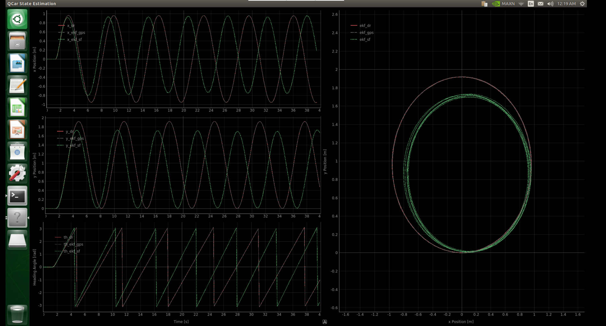

# QCar Control and Estimation Framework

## Overview
This project implements a control and estimation framework for a QCar system, leveraging sensor fusion techniques with Kalman Filters (KF) and Extended Kalman Filters (EKF). The system integrates data from gyroscopes, GPS, and motor tachometers to estimate the state of the vehicle, including position, heading angle, and sensor biases. 

---

## Features
- **Control System**:
  - Applies throttle and steering inputs to control the QCar.
  - Ensures inputs stay within safe limits:
    - Throttle (`u`) is capped at 0.2.
    - Steering angle (`delta`) is limited to \( \pm \pi/6 \) radians.

- **Sensor Fusion**:
  - Combines data from multiple sensors (gyroscope, GPS, motor tachometer) to improve state estimation accuracy.

- **Estimation Techniques**:
  - **Dead Reckoning EKF**: Estimates state using the vehicle’s motion model without external corrections.
  - **EKF with GPS Integration**: Combines the motion model with GPS data for position and heading correction.
  - **Cascaded KF**:
    - KF for heading estimation using gyroscope and GPS heading data.
    - EKF combining the kinematic bicycle model with GPS position and the heading estimate from the KF.

- **Visualizations**:
  - Real-time plots for position, heading, and trajectory estimates.
  - Tracks the performance of different estimators over time.

---

## Estimators Used
### 1. Dead Reckoning EKF
- **Purpose**: Predicts the state (position, heading) using only the motion model and gyroscope data.
- **Limitations**: Prone to drift over time due to uncorrected sensor biases and noise.

### 2. EKF with GPS Integration
- **Purpose**: Enhances the dead reckoning EKF by integrating GPS position and heading data for corrections.
- **Noise Handling**:
  - Process noise covariance: Models uncertainty in the motion model.
  - Measurement noise covariance: Models GPS sensor inaccuracies.

### 3. Cascaded KF
- **Purpose**: Provides robust state estimation through a two-stage approach:
  - **Stage 1**: KF for heading estimation, fusing gyroscope and GPS heading measurements.
  - **Stage 2**: EKF combining the bicycle motion model with GPS position and the KF's heading estimate.

---

## Key Concepts
### Kinematic Bicycle Model
- Describes the vehicle’s motion based on:
  - Speed (`v`): Derived from the motor tachometer.
  - Steering angle (`delta`): Controlled input.
- Used in prediction steps to estimate the vehicle’s position and heading.

### Dead Reckoning
- Computes state estimates by integrating sensor data over time.
- Accumulates errors due to sensor biases and noise.

### Sensor Fusion
- Combines fast gyroscope measurements with slower, noisier GPS updates.
- Reduces uncertainty and corrects for sensor drift.

### Kalman Filter
- Prediction Step:
  - Updates the state estimate based on the motion model.
  - Accounts for process noise.
- Correction Step:
  - Adjusts the state estimate using sensor measurements.
  - Balances trust between prediction and measurement using the Kalman Gain.

---

## System Architecture
### Inputs
1. **Gyroscope**:
   - Measures angular velocity (\( \dot{\theta} \)) for heading updates.
2. **Motor Tachometer**:
   - Measures vehicle speed.
3. **GPS**:
   - Provides noisy position and heading data.

### Outputs
1. **State Estimates**:
   - Position (\(x, y\)).
   - Heading (\( \theta \)).
   - Gyroscope bias (\(b\)).
2. **Control Inputs**:
   - Throttle (`u`).
   - Steering angle (`delta`).

---

## Performance Monitoring
Real-time visualizations include:
1. **Position Estimates**:
   - Comparisons between dead reckoning EKF, EKF with GPS, and cascaded KF.
2. **Heading Estimates**:
   - Tracks orientation estimates over time.
3. **Trajectory**:
   - Plots the estimated path of the vehicle.
4. **Bias Estimates**:
   - Monitors gyroscope bias correction in the cascaded KF.

---

## Future Improvements
1. **Handling GPS Outages**:
   - Develop strategies to maintain accuracy during prolonged GPS unavailability.
2. **Adaptive Noise Models**:
   - Dynamically adjust noise covariances (`Q` and `R`) based on sensor reliability.
3. **Enhanced Visualization**:
   - Add error analysis plots for estimator performance evaluation.

---

## Applications
This framework is suitable for autonomous navigation and control tasks in:
- Robotic vehicles.
- Unmanned ground vehicles (UGVs).
- Simulated or real-world autonomous driving scenarios.

---

For detailed implementation, refer to the respective Kalman Filter classes (`QcarEKF` and `GyroKF`) and the main control loop logic.

